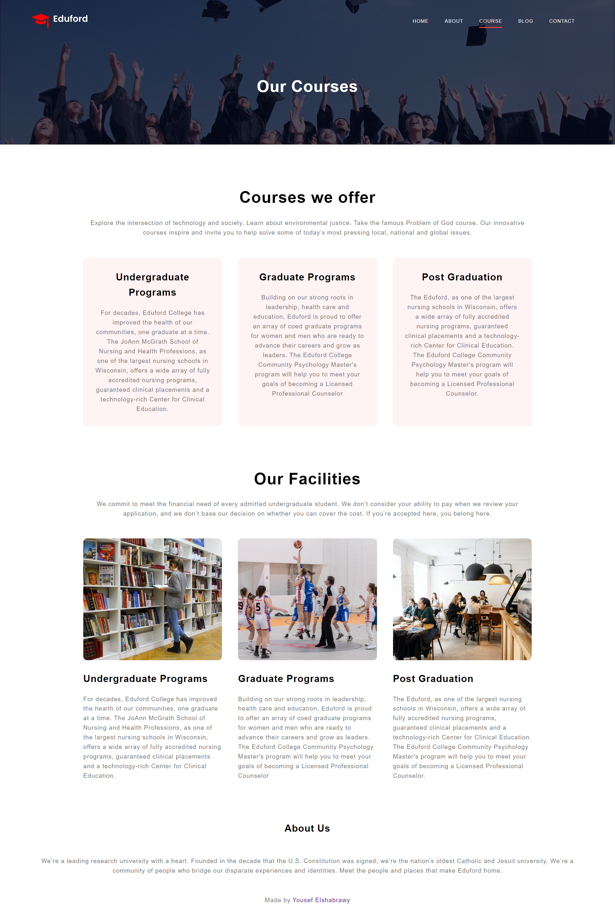
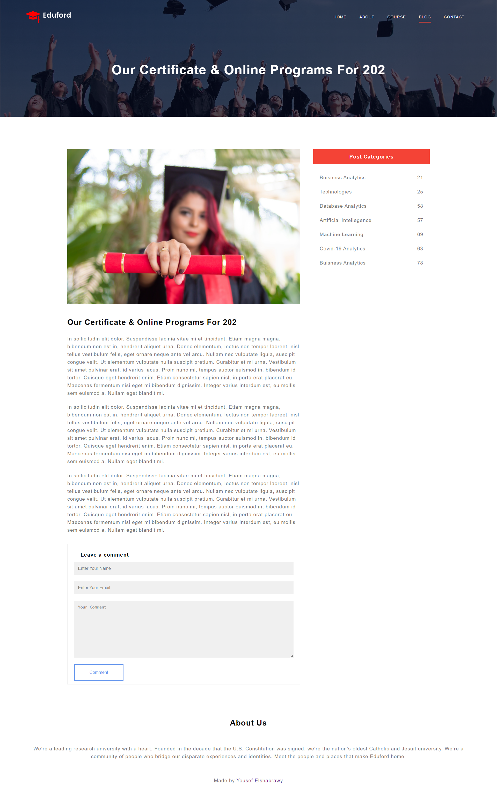
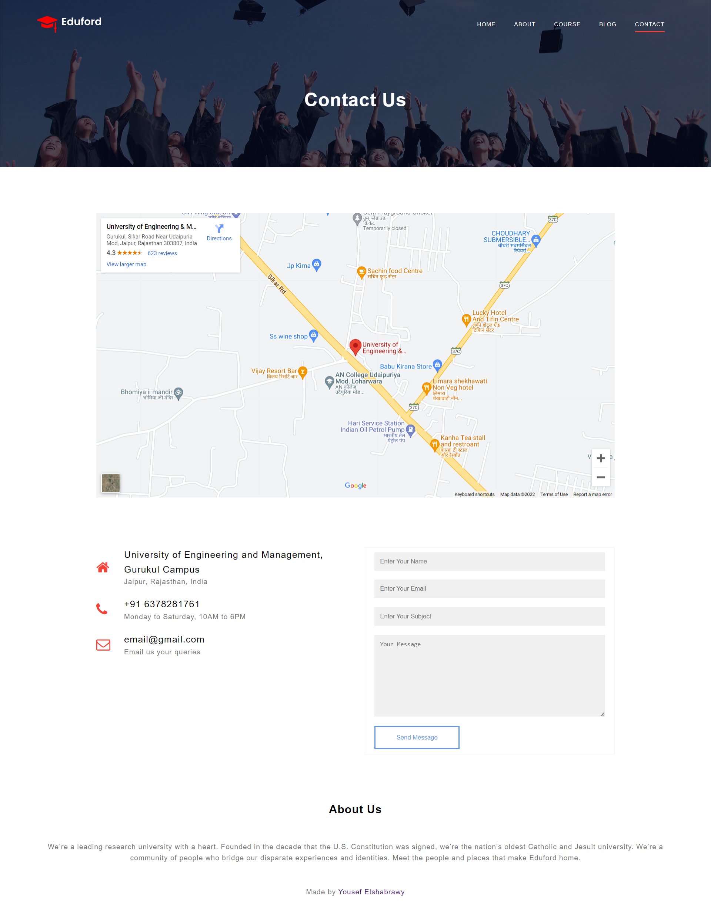
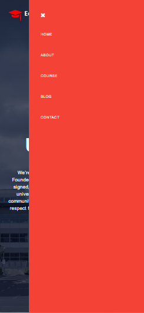

# Eduford

<div align="center">
 
</div>

---

## 🏁 Get Started

### Installation

1. **_Clone the repository_**

```sh
git clone https://github.com/YousefElshabrawy/Eduford.git
```

2. **_Navigate to repository directory_**

```sh
$ cd Eduford
```

3. **_Install dependencies_**

```sh
$ npm install
```

### Running

1. **_Compile and hot-reload for development_**

```sh
$ npm run start
```

2. **_Compile, prefix and minify for production_**

```sh
$ npm run build
```

---

## 💻 Built With

- **HTML**
- **SASS**
- **BEM Methodology**
- **JavaScript**

---

## 📂 File Structure

```sh
|-- README.md
|-- about.html
|-- blog.html
|-- contact.html
|-- course.html
|-- css
|   |-- README.md
|   |-- style.comp.css
|   |-- style.css
|   `-- style.prefix.css
|-- images
|   |-- README.md
|   |-- about.jpg
|   |-- background.jpg
|   |-- banner.png
|   |-- banner2.jpg
|   |-- basketball.png
|   |-- cafeteria.png
|   |-- certificate.jpg
|   |-- library.png
|   |-- logo.png
|   |-- london.png
|   |-- newyork.png
|   |-- user1.jpg
|   |-- user2.jpg
|   `-- washington.png
|-- index.html
|-- package-lock.json
|-- package.json
|-- sass
|   |-- README.md
|   |-- abstracts
|   |   |-- README.md
|   |   |-- _mixins.scss
|   |   `-- _variables.scss
|   |-- base
|   |   |-- README.md
|   |   |-- _animations.scss
|   |   |-- _base.scss
|   |   |-- _typography.scss
|   |   `-- _utilities.scss
|   |-- components
|   |   |-- README.md
|   |   |-- _button.scss
|   |   `-- _form.scss
|   |-- layout
|   |   |-- README.md
|   |   |-- _footer.scss
|   |   `-- _navbar.scss
|   |-- main.scss
|   `-- pages
|       |-- README.md
|       |-- _about.scss
|       |-- _blog.scss
|       |-- _contact.scss
|       |-- _course.scss
|       `-- _home.scss
`-- ss
    |-- README.md
    |-- desktop
    |   |-- README.md
    |   |-- about.png
    |   |-- blog.png
    |   |-- contact.png
    |   |-- course.png
    |   `-- home.png
    |-- eduford.jpg
    |-- mobile
    |   |-- README.md
    |   |-- about.png
    |   |-- blog.png
    |   |-- contact.png
    |   |-- course.png
    |   |-- home.png
    |   `-- menu.png
    `-- tablet
        |-- README.md
        |-- about.png
        |-- blog.png
        |-- contact.png
        |-- course.png
        `-- home.png
```

---

## 📷 Responsiveness

- ### Desktop Screen
  
  <br>
  
  <br>
  
  <br>
  
  <br>
  
- ### Tablet Screen
  
  <br>
  
  <br>
  
  <br>
  
  <br>
  
- ### Mobile Phone Screen
  
  <br>
  
  <br>
  
  <br>
  
  <br>
  
  <br>
  
